# 📊 Практична робота: Створення баз даних, робота зі зв’язками (JOIN) та аналітичні вибірки в MySQL

Цей репозиторій містить рішення практичних завдань зі створення реляційної схеми даних, налагодження зв'язків між таблицями (DDL/DML), а також об'єднання таблиць (INNER, LEFT, RIGHT JOIN), фільтрації та агрегації за допомогою мови SQL у СУБД MySQL.

---

## 📌 Завдання 1. Створення бази даних та таблиць бібліотеки (DDL)

Створення схеми `LibraryManagement` та структури таблиць із первинними й зовнішніми ключами для забезпечення цілісності даних.

### 1.1. Створення схеми "LibraryManagement"

```sql
CREATE SCHEMA LibraryManagement;
USE LibraryManagement;

```

**Результат виконання:**
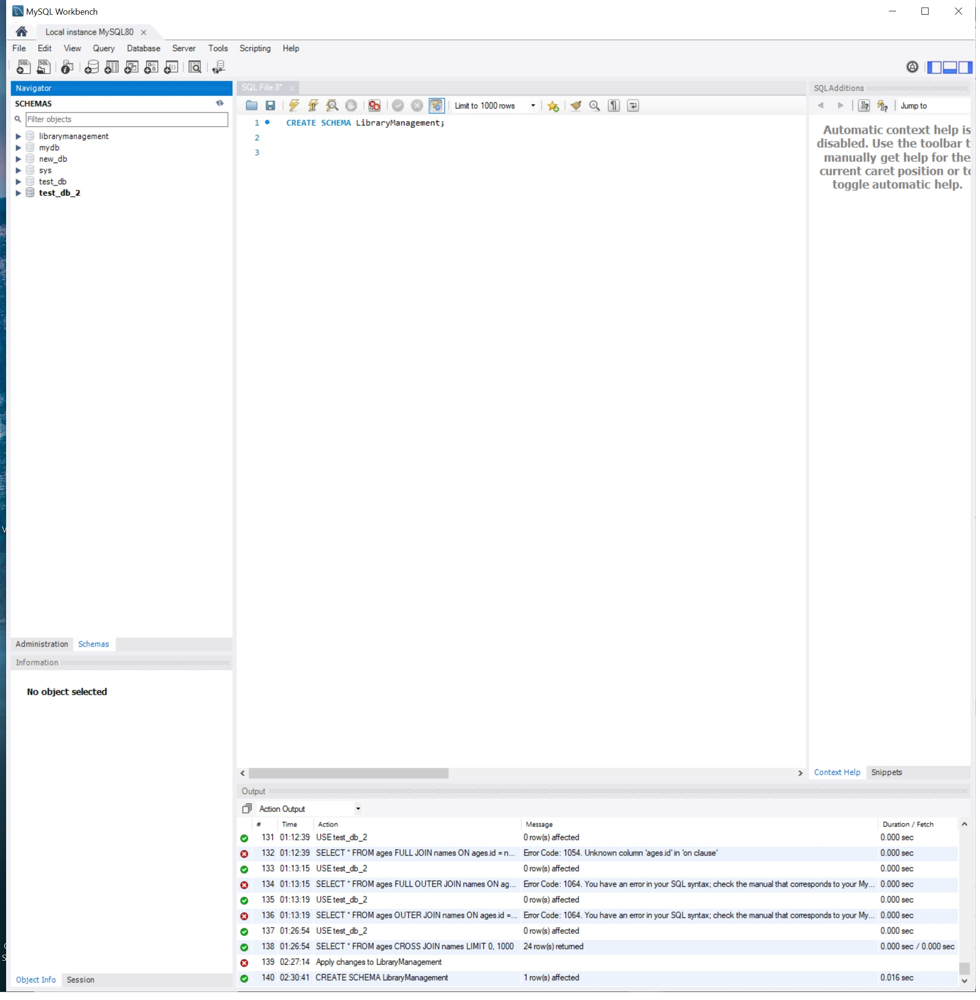

---

### 1.2. Створення структури таблиць

Створення таблиць `authors`, `genres`, `books`, `users`, `borrowed_books` із визначенням `PRIMARY KEY` та `FOREIGN KEY`[cite: 2].

```sql
USE LibraryManagement;

CREATE TABLE authors (
    author_id INT AUTO_INCREMENT PRIMARY KEY,
    author_name VARCHAR(255) NOT NULL
);

CREATE TABLE genres (
    genre_id INT AUTO_INCREMENT PRIMARY KEY,
    genre_name VARCHAR(255) NOT NULL
);

CREATE TABLE books (
    book_id INT AUTO_INCREMENT PRIMARY KEY,
    title VARCHAR(255) NOT NULL,
    publication_year YEAR,
    author_id INT,
    genre_id INT,
    FOREIGN KEY (author_id) REFERENCES authors(author_id),
    FOREIGN KEY (genre_id) REFERENCES genres(genre_id)
);

CREATE TABLE users (
    user_id INT AUTO_INCREMENT PRIMARY KEY,
    username VARCHAR(255) NOT NULL,
    email VARCHAR(255) NOT NULL
);

CREATE TABLE borrowed_books (
    borrow_id INT AUTO_INCREMENT PRIMARY KEY,
    book_id INT,
    user_id INT,
    borrow_date DATE NOT NULL,
    return_date DATE,
    FOREIGN KEY (book_id) REFERENCES books(book_id),
    FOREIGN KEY (user_id) REFERENCES users(user_id)
);

```

**Результат виконання:**
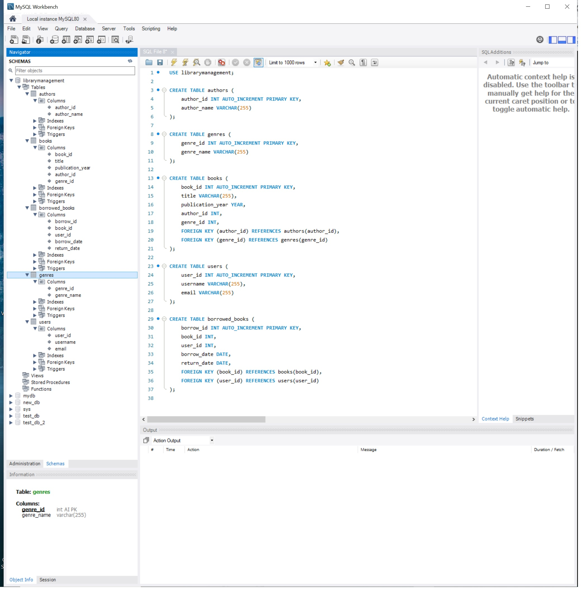

---

## 📌 Завдання 2. Наповнення таблиць тестовими даними (DML)

Додавання тестових записів у кожну таблицю з дотриманням зв'язків між сутностями[cite: 3].

### 2.1. Вставка записів у таблиці

```sql
USE LibraryManagement;

INSERT INTO authors (author_id, author_name)
VALUES (1, 'Arthur Conan Doyle');

INSERT INTO genres (genre_id, genre_name)
VALUES (1, 'Detective');

INSERT INTO books (book_id, title, publication_year, author_id, genre_id)
VALUES (1, 'The Hound of the Baskervilles', 1902, 1, 1);

INSERT INTO users (user_id, username, email)
VALUES (1, 'John Doe', 'johndoe.test@mail.com');

INSERT INTO borrowed_books (borrow_id, book_id, user_id, borrow_date, return_date)
VALUES (1, 1, 1, '2026-10-01', '2026-10-15');

```

**Результат виконання:**
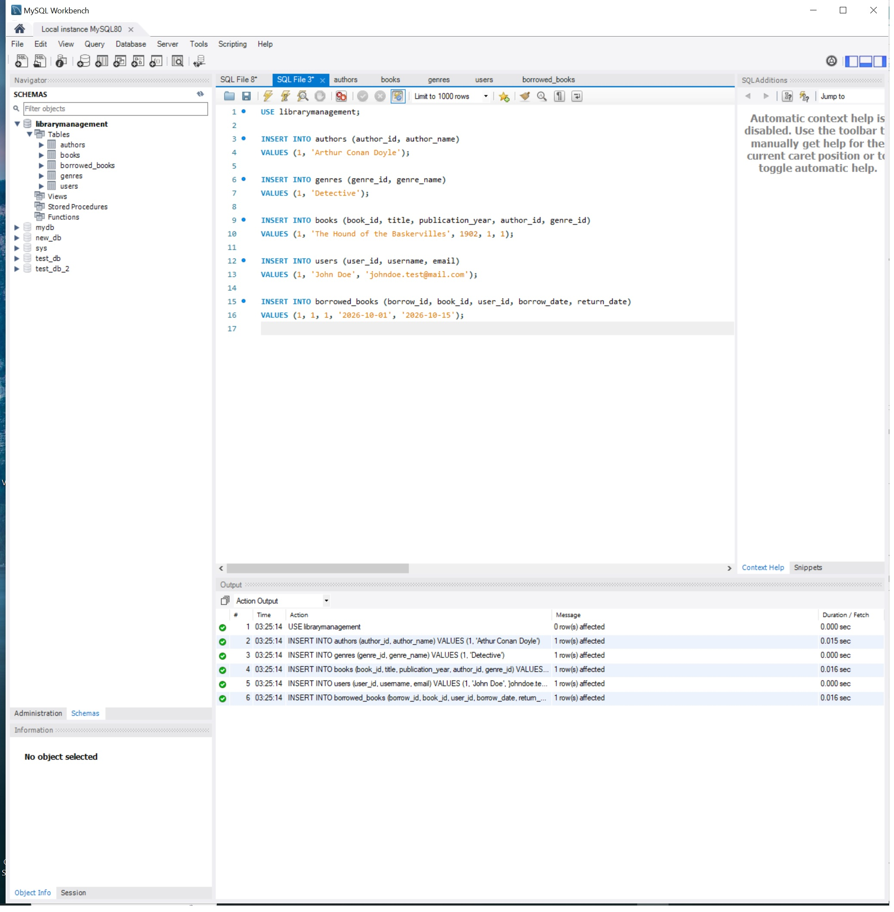

---

### 2.2. Перевірка таблиці `authors`

```sql
SELECT * FROM librarymanagement.authors;

```

**Результат виконання:**
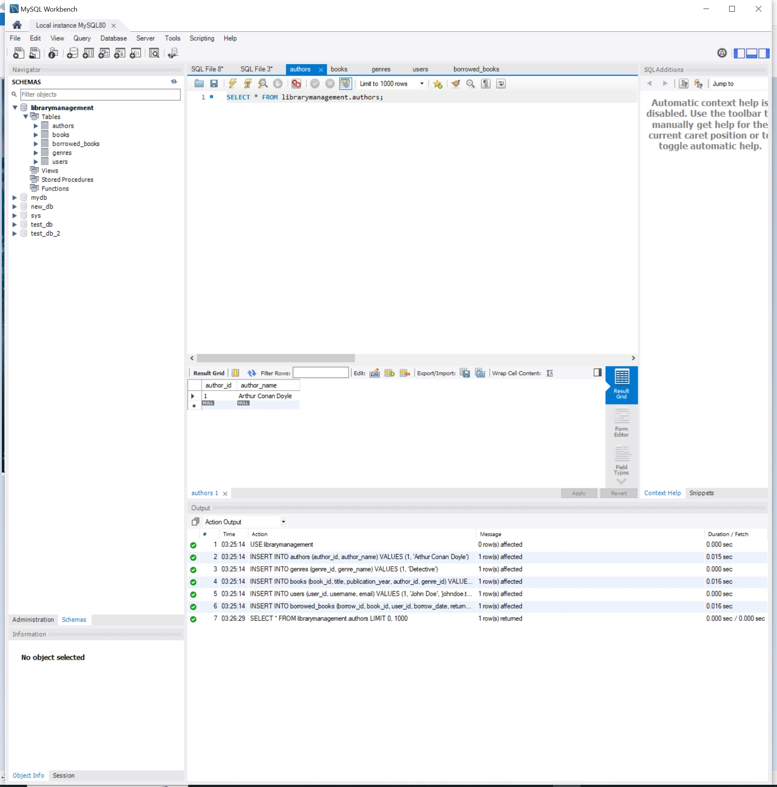

---

### 2.3. Перевірка таблиці `books`

```sql
SELECT * FROM librarymanagement.books;

```

**Результат виконання:**
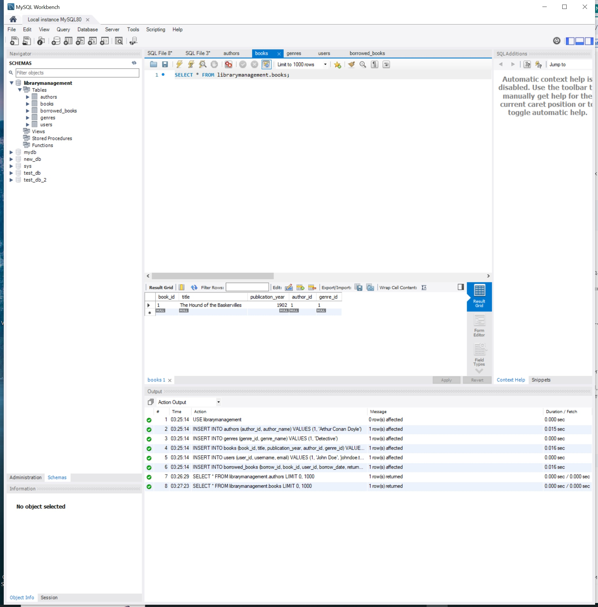

---

### 2.4. Перевірка таблиці `genres`

```sql
SELECT * FROM librarymanagement.genres;

```

**Результат виконання:**
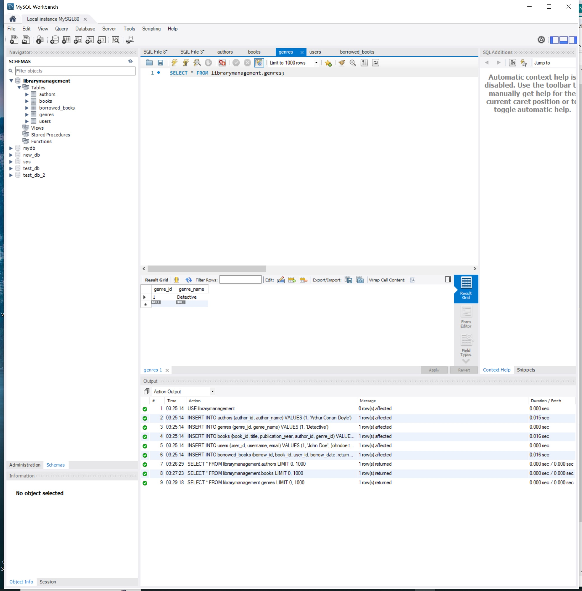

---

### 2.5. Перевірка таблиці `users`

```sql
SELECT * FROM librarymanagement.users;

```

**Результат виконання:**
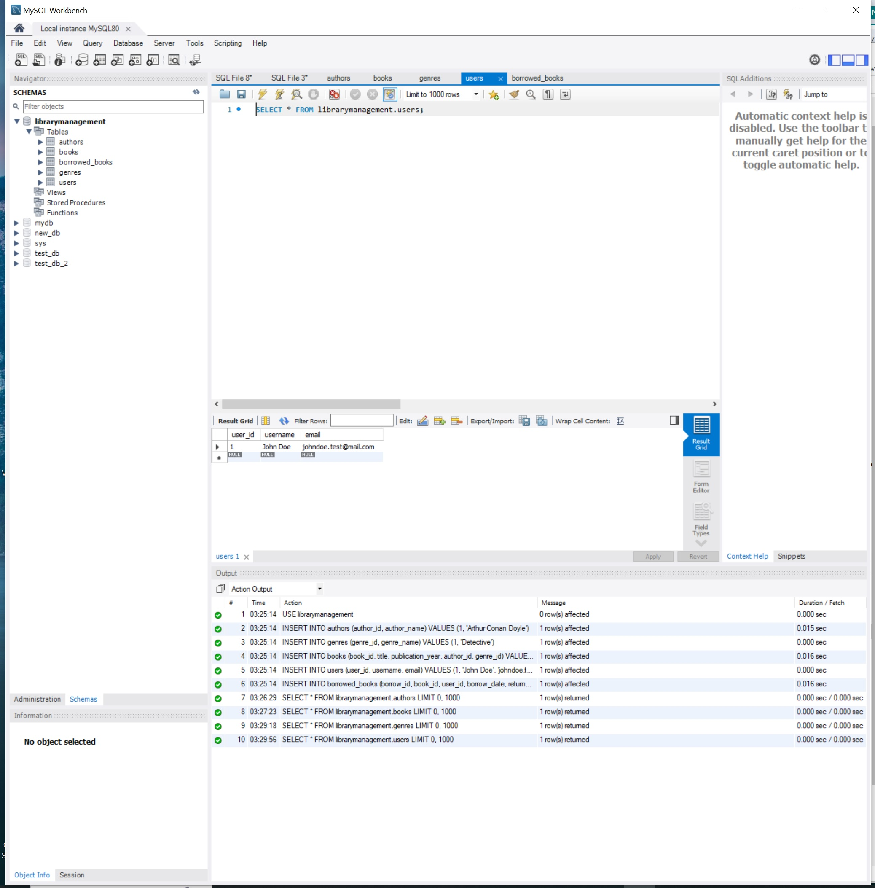

---

### 2.6. Перевірка таблиці `borrowed_books`

```sql
SELECT * FROM librarymanagement.borrowed_books;

```

**Результат виконання:**
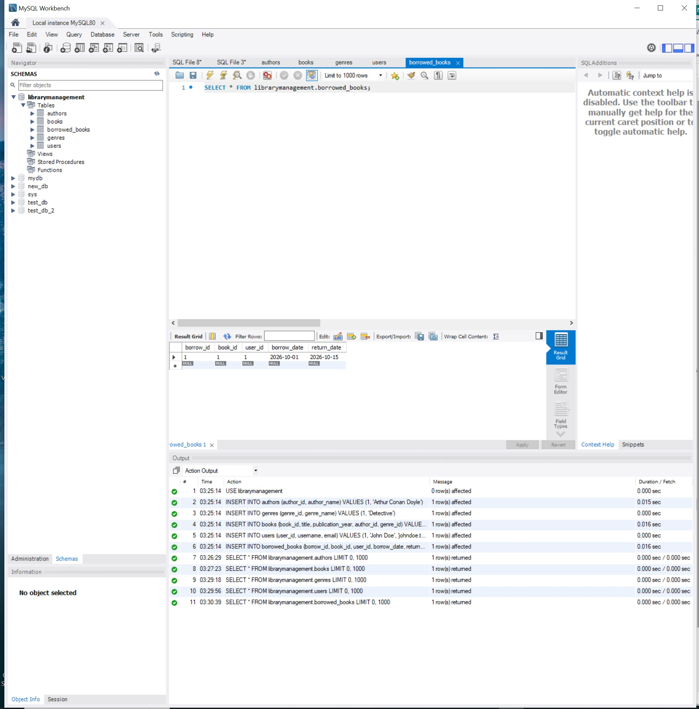

---

## 📌 Завдання 3. Об'єднання всіх таблиць бази замовлень (INNER JOIN)

Об'єднання 8 таблиць даних (`orders`, `customers`, `employees`, `shippers`, `order_details`, `products`, `categories`, `suppliers`) за спільними первинними та зовнішніми ключами[cite: 9, 10].

### 3.1. Вибірка всіх стовпчиків (`SELECT *`)

```sql
USE test_db;

SELECT *
FROM orders o
    INNER JOIN customers c ON c.id = o.customer_id
    INNER JOIN employees e ON e.employee_id = o.employee_id
    INNER JOIN shippers s ON s.id = o.shipper_id
    INNER JOIN order_details od ON od.order_id = o.id
    INNER JOIN products p ON p.id = od.product_id
    INNER JOIN categories cat ON cat.id = p.category_id
    INNER JOIN suppliers sup ON sup.id = p.supplier_id;

```

**Результат виконання:**
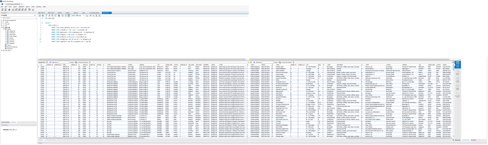

---

### 3.2. Вибірка окремих атрибутів із зазначенням аліасів

Проєкція ключових полів для усунення дублювання назв стовпчиків між з'єднаними таблицями[cite: 10].

```sql
USE test_db;

SELECT 
    o.id AS order_id,
    o.date AS order_date,
    c.id AS customer_id,
    c.name AS customer_name,
    c.contact AS customer_contact,
    c.city AS customer_city,
    c.country AS customer_country,
    e.employee_id,
    CONCAT(e.first_name, ' ', e.last_name) AS employee_name,
    s.id AS shipper_id,
    s.name AS shipper_name,
    p.id AS product_id,
    p.name AS product_name,
    cat.id AS category_id,
    cat.name AS category_name,
    sup.id AS supplier_id,
    sup.name AS supplier_name,
    od.quantity,
    p.unit AS product_unit,
    p.price AS unit_price
FROM orders o
    INNER JOIN customers c ON c.id = o.customer_id
    INNER JOIN employees e ON e.employee_id = o.employee_id
    INNER JOIN shippers s ON s.id = o.shipper_id
    INNER JOIN order_details od ON od.order_id = o.id
    INNER JOIN products p ON p.id = od.product_id
    INNER JOIN categories cat ON cat.id = p.category_id
    INNER JOIN suppliers sup ON sup.id = p.supplier_id;

```

**Результат виконання:**
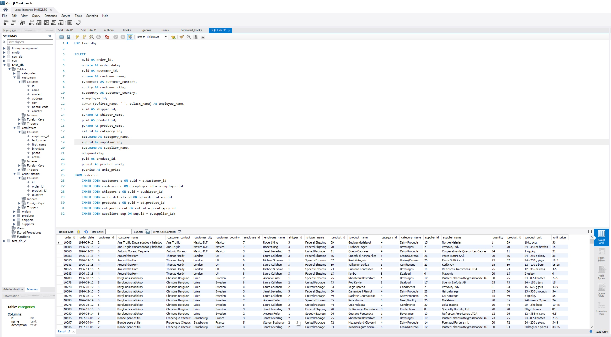

---

## 📌 Завдання 4. Аналітичні запити, фільтрація та агрегація даних

### 4.1. Підрахунок загальної кількості рядків (COUNT)

Підрахунок загальної кількості рядків у результаті об'єднання всіх таблиць через `INNER JOIN`.

```sql
USE test_db;

SELECT 
    COUNT(*) AS total_rows
FROM orders o
    INNER JOIN customers c ON c.id = o.customer_id
    INNER JOIN employees e ON e.employee_id = o.employee_id
    INNER JOIN shippers s ON s.id = o.shipper_id
    INNER JOIN order_details od ON od.order_id = o.id
    INNER JOIN products p ON p.id = od.product_id
    INNER JOIN categories cat ON cat.id = p.category_id
    INNER JOIN suppliers sup ON sup.id = p.supplier_id;

```

**Результат виконання:**
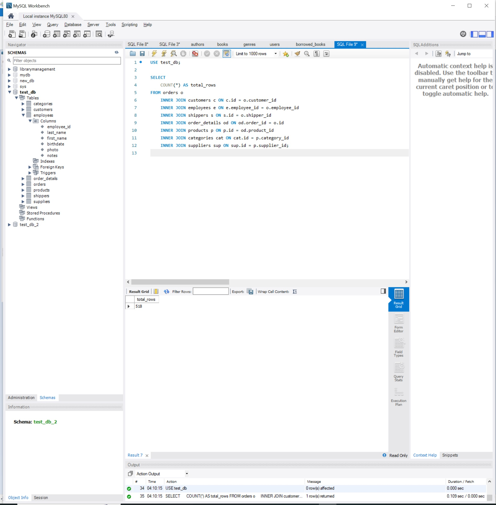


---

### 4.2. Дослідження зміни `INNER JOIN` на `RIGHT / LEFT JOIN`

Визначення впливу операторів зовнішнього з'єднання на розмір вибірки.

```sql
USE test_db;

SELECT 
    COUNT(*) AS total_rows
FROM orders o
    RIGHT JOIN customers c ON c.id = o.customer_id
    LEFT JOIN employees e ON e.employee_id = o.employee_id
    LEFT JOIN shippers s ON s.id = o.shipper_id
    LEFT JOIN order_details od ON od.order_id = o.id
    LEFT JOIN products p ON p.id = od.product_id
    LEFT JOIN categories cat ON cat.id = p.category_id
    LEFT JOIN suppliers sup ON sup.id = p.supplier_id;

```

**Результат виконання:**
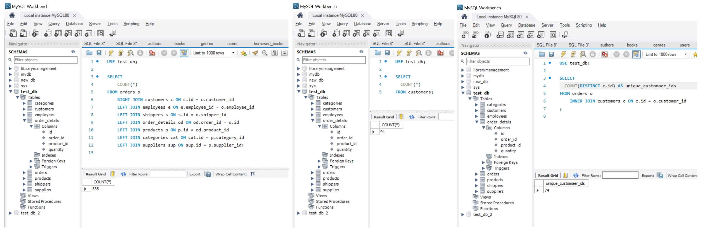

**Аналіз результатів:**
У результаті виконання запиту кількість рядків збільшилася з **518** (при `INNER JOIN`) до **535** (на **17** рядків більше).

1. Оператор `RIGHT JOIN customers c ON c.id = o.customer_id` змушує запит зберегти абсолютно всі записи з правої таблиці `customers`, навіть якщо для них немає відповідних замовлень у таблиці `orders`.
2. У базі налічується 91 клієнт, із яких замовлення оформлювали лише 74. Відповідно, рівно 17 клієнтів не мають жодного замовлення (`orders.customer_id IS NULL`).
3. Оскільки всі наступні з’єднання виконані через `LEFT JOIN`, вони беруть за основу вже сформовану вибірку і підставляють для відсутніх значень `NULL`, не відсікаючи рядки. Через це всі 17 клієнтів без замовлень потрапляють у фінальний результат ($518 + 17 = 535$).

---

### 4.3. Фільтрація рядків за співробітниками (WHERE)

Фільтрація вибірки з пункту 3 за умовою `employee_id > 3 AND <= 10`.

```sql
USE test_db;

SELECT *
FROM orders o
    INNER JOIN customers c ON c.id = o.customer_id
    INNER JOIN employees e ON e.employee_id = o.employee_id
    INNER JOIN shippers s ON s.id = o.shipper_id
    INNER JOIN order_details od ON od.order_id = o.id
    INNER JOIN products p ON p.id = od.product_id
    INNER JOIN categories cat ON cat.id = p.category_id
    INNER JOIN suppliers sup ON sup.id = p.supplier_id
WHERE e.employee_id > 3 AND e.employee_id <= 10;

```

**Результат виконання:**
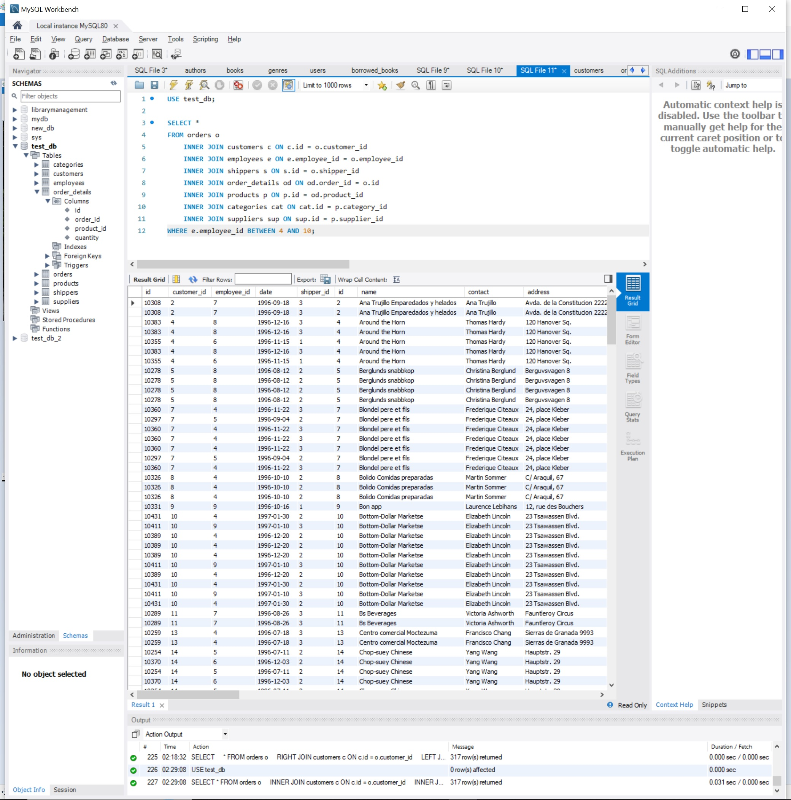

---

### 4.4. Групування за категорією та агрегація (GROUP BY, AVG, COUNT)

Групування даних за назвою категорії товару з розрахунком кількості рядків у групі та середньої кількості замовленого товару.

```sql
USE test_db;

SELECT 
    cat.name AS category_name,
    COUNT(*) AS rows_in_group,
    ROUND(AVG(od.quantity), 2) AS avg_quantity
FROM orders o
    INNER JOIN customers c ON c.id = o.customer_id
    INNER JOIN employees e ON e.employee_id = o.employee_id
    INNER JOIN shippers s ON s.id = o.shipper_id
    INNER JOIN order_details od ON od.order_id = o.id
    INNER JOIN products p ON p.id = od.product_id
    INNER JOIN categories cat ON cat.id = p.category_id
    INNER JOIN suppliers sup ON sup.id = p.supplier_id
GROUP BY cat.name;

```

**Результат виконання:**
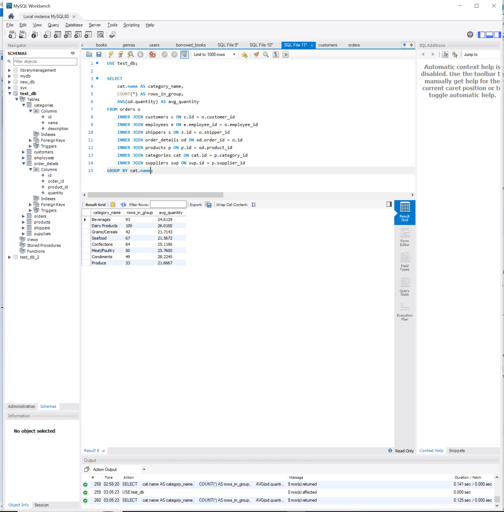

---

### 4.5. Фільтрація агрегованих груп (HAVING)

Відбір тільки тих категорій, у яких середня кількість замовленого товару перевищує 21 одиницю.

```sql
USE test_db;

SELECT 
    cat.name AS category_name,
    COUNT(*) AS rows_in_group,
    ROUND(AVG(od.quantity), 2) AS avg_quantity
FROM orders o
    INNER JOIN customers c ON c.id = o.customer_id
    INNER JOIN employees e ON e.employee_id = o.employee_id
    INNER JOIN shippers s ON s.id = o.shipper_id
    INNER JOIN order_details od ON od.order_id = o.id
    INNER JOIN products p ON p.id = od.product_id
    INNER JOIN categories cat ON cat.id = p.category_id
    INNER JOIN suppliers sup ON sup.id = p.supplier_id
GROUP BY cat.name
HAVING AVG(od.quantity) > 21;

```

**Результат виконання:**
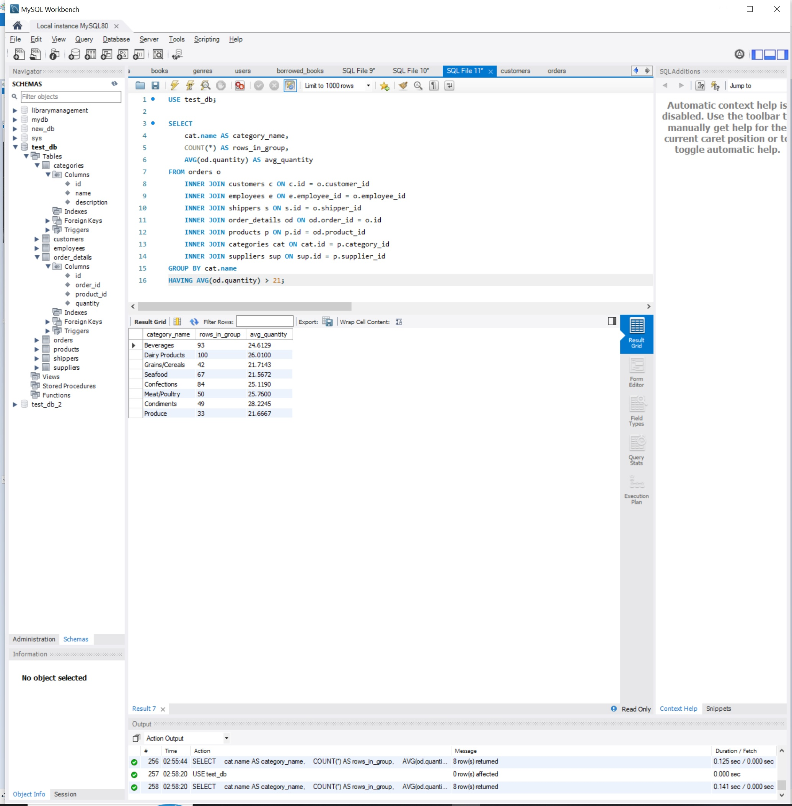

---

### 4.6. Сортування результатів (ORDER BY DESC)

Сортування згрупованих категорій за спаданням кількості рядків у кожній групі.

```sql
USE test_db;

SELECT 
    cat.name AS category_name,
    COUNT(*) AS rows_in_group,
    ROUND(AVG(od.quantity), 2) AS avg_quantity
FROM orders o
    INNER JOIN customers c ON c.id = o.customer_id
    INNER JOIN employees e ON e.employee_id = o.employee_id
    INNER JOIN shippers s ON s.id = o.shipper_id
    INNER JOIN order_details od ON od.order_id = o.id
    INNER JOIN products p ON p.id = od.product_id
    INNER JOIN categories cat ON cat.id = p.category_id
    INNER JOIN suppliers sup ON sup.id = p.supplier_id
GROUP BY cat.name
HAVING AVG(od.quantity) > 21
ORDER BY rows_in_group DESC;

```

**Результат виконання:**
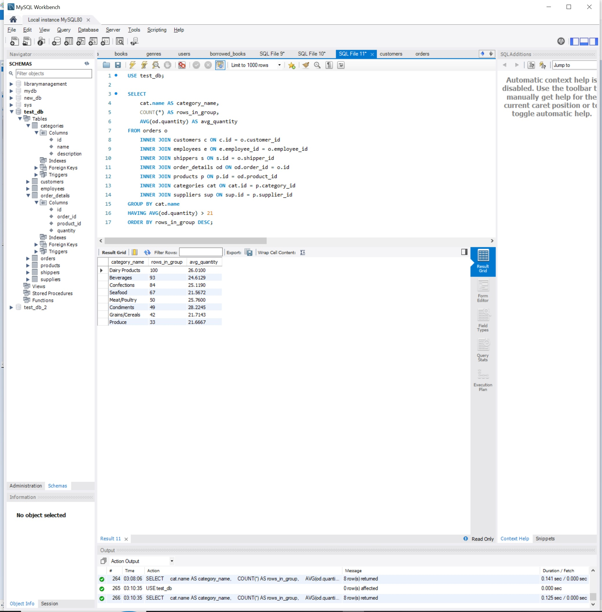

---

### 4.7. Пагінація результату (LIMIT, OFFSET)

Виведення 4 рядків вибірки з пропуском першого результату.

```sql
USE test_db;

SELECT 
    cat.name AS category_name,
    COUNT(*) AS rows_in_group,
    ROUND(AVG(od.quantity), 2) AS avg_quantity
FROM orders o
    INNER JOIN customers c ON c.id = o.customer_id
    INNER JOIN employees e ON e.employee_id = o.employee_id
    INNER JOIN shippers s ON s.id = o.shipper_id
    INNER JOIN order_details od ON od.order_id = o.id
    INNER JOIN products p ON p.id = od.product_id
    INNER JOIN categories cat ON cat.id = p.category_id
    INNER JOIN suppliers sup ON sup.id = p.supplier_id
GROUP BY cat.name
HAVING AVG(od.quantity) > 21
ORDER BY rows_in_group DESC
LIMIT 4 OFFSET 1;

```

**Результат виконання:**
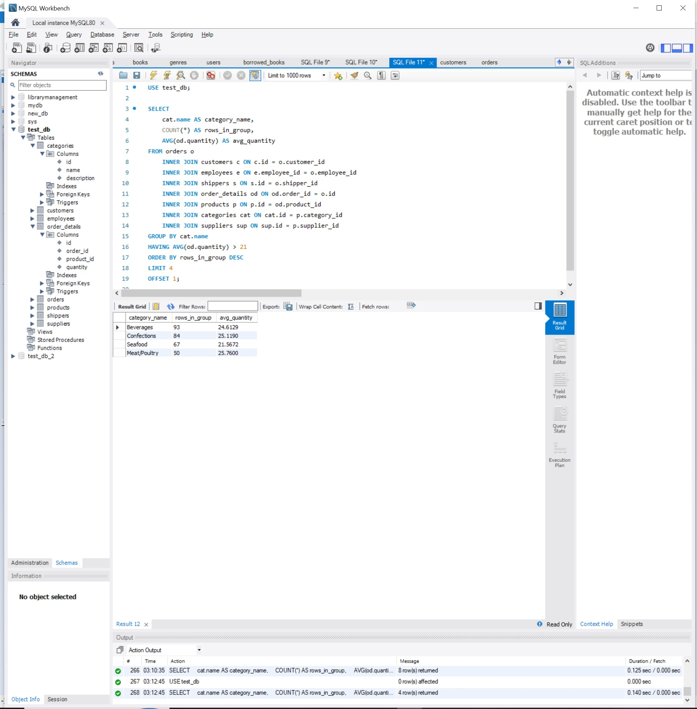